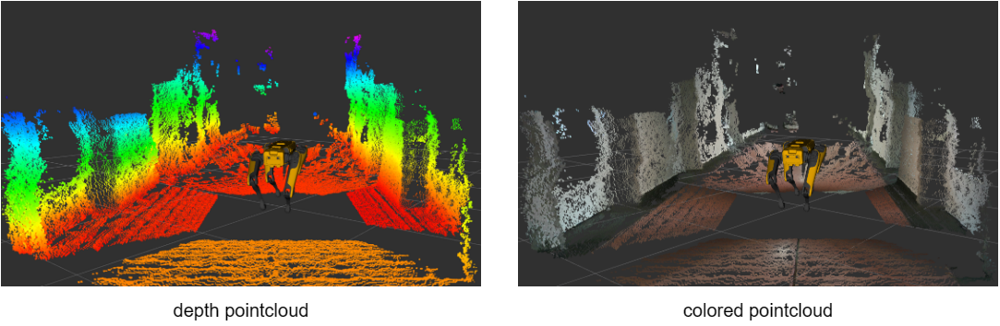
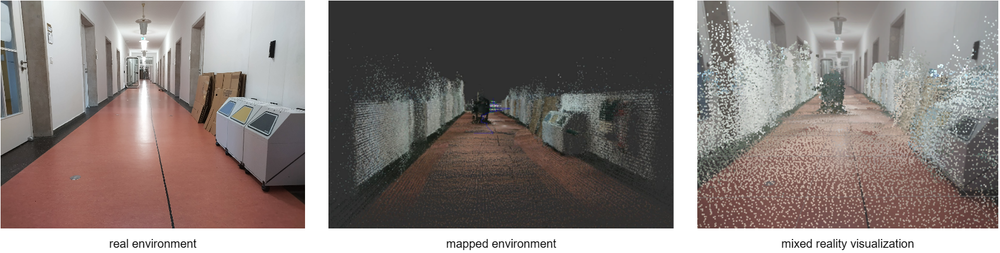
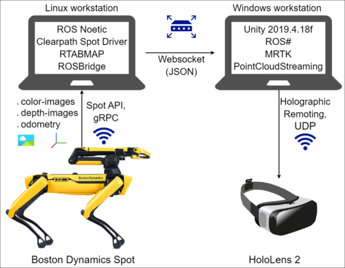

# Real-Time Mapping with Boston Dynamics Spot and Microsoft HoloLens 2

## Description

Visualize the Boston Dynamics Robot Dog environment as 3D map in Augmented Reality in real-time.  

## Prerequisites

* Linux workstation
  * use Ubuntu 20.04
  * 2 network interface controllers (NIC)
    * one for connecting to wireless network provided from Spot robot
    * one for connecting to windows workstation via router
  * installation instructions described [here](#linux-workstation-setup) (ROS Noetic, Spot Driver, RTABMAP, Rosbridge)

* Windows workstation
  * use Windows 10/11
  * installation instructions described [here](#windows-workstation-setup) (Unity, ROS#, MRTK, PointCloudStreaming)

* optional: Microsoft HoloLens (use emulator instead)
* optional: Boston Dynamics Spot robot (use provided [datasets](https://cloudstore.zih.tu-dresden.de/index.php/s/JybxMZdqL84oepP) instead)

## Setup

### Technical setup overview



### Linux workstation setup

#### ROS Noetic and Spot Driver from [Clearpath Robotics](https://www.clearpathrobotics.com/assets/guides/melodic/spot-ros/ros_setup.html)

* run [setup.sh](src/setup.sh)

  ```bash
  # Spot ROS Computer Setup
  chmod +x setup.sh
  ./setup.sh
  ```


* verify successful installation with

  ```bash
  # rviz should open with a model of the Spot robot
  roslaunch spot_viz view_model.launch
  ```


* optional: source shell script automatically in terminal (otherwise source every terminal manually)

  ```bash
  nano ~/.bashrc
  ```
  * add following line to .bashrc-file:

    ```bash
    source ~/catkin_ws/devel/setup.bash
    ```


* edit driver.launch (change dummypassword, dummyusername, hostname) 
  * default IP of Spot: 192.168.80.3
  * [Spot network setup](https://support.bostondynamics.com/s/article/Spot-network-setup)

  ```bash
  cd ~/catkin_ws/src/spot_ros/spot_driver/launch
  nano driver.launch
  ```


* replace [spot-driver](src/python/spot_driver) python files

  ```bash
  rm -r ~/catkin_ws/src/spot_ros/spot_driver/src/spot_driver/
  cp -r REPO_PYTHON_SRC_DIR ~/catkin_ws/src/spot_ros/spot_driver/src/
  ```


* replace [robot.rviz](src/rviz/robot.rviz) file 

  ```bash
  rm ~/catkin_ws/src/spot_ros/spot_viz/rviz/robot.rviz
  cp REPO_RVIZ_SRC_FILE ~/catkin_ws/src/spot_ros/spot_viz/rviz/
  ```


* ready to visualize the robots environment
  * run in one terminal:

    ```bash
    roslaunch spot_driver driver.launch
    ```
  * run in a second terminal:

    ```bash
    roslaunch spot_viz view_robot.launch
    ```
  * TODO: comment about topics (monitoring, control), comment about messages (type, hz, bw), images (rqt_graph, rviz)
* emulate Spot robot (use provided [datasets](https://cloudstore.zih.tu-dresden.de/index.php/s/JybxMZdqL84oepP)) 
  * run in third terminal:

  ```bash
  rosbag play --clock name_of_file.bag
  ```

  (--clock: causes rosbag play to publish simulated time synchronized to the messages in the bag file to the clock topic) 
  [ROS Doku Rosbag](https://wiki.ros.org/rosbag/Commandline)
  
Further information on Spot ROS Driver Usage can be found [here](https://www.clearpathrobotics.com/assets/guides/melodic/spot-ros/ros_usage.html)

#### RTABMAP_ROS

* installation

  ```bash
  sudo apt install ros-noetic-rtabmap-ros
  ```
* TODO replace [robot.rviz](src/rviz/rtabmap.rviz) file 
* running launch-file
  * using only one camera ([Link to launch-script](src/launch/rtabmap_spot_singlecam.launch)) (TODO: comment what to change for specific cam)

    ```bash
    roslaunch rtabmap_ros rtabmap_spot_singlecam.launch
    ```
  * using multiple cameras ([Link to launch-script](src/launch/rtabmap_spot_multicam.launch)) (TODO: comment what to change for specific number of cams)

    ```bash
    roslaunch rtabmap_ros rtabmap_spot_multicam.launch
    ```

[ROS Doku RTABMAP](http://wiki.ros.org/rtabmap_ros)

* comment: optional parameter (rviz:..., rtabmapviz:..., use_sim_time:..., etc.)

#### rosbridge

* installation

```bash
sudo apt-get install ros-noetic-rosbridge-suite
```

* running rosbridge

```bash
roslaunch rosbridge_server rosbridge_websocket.launch
```

[ROS Doku Rosbridge](http://wiki.ros.org/rosbridge_suite/Tutorials/RunningRosbridge)

### Windows workstation setup
